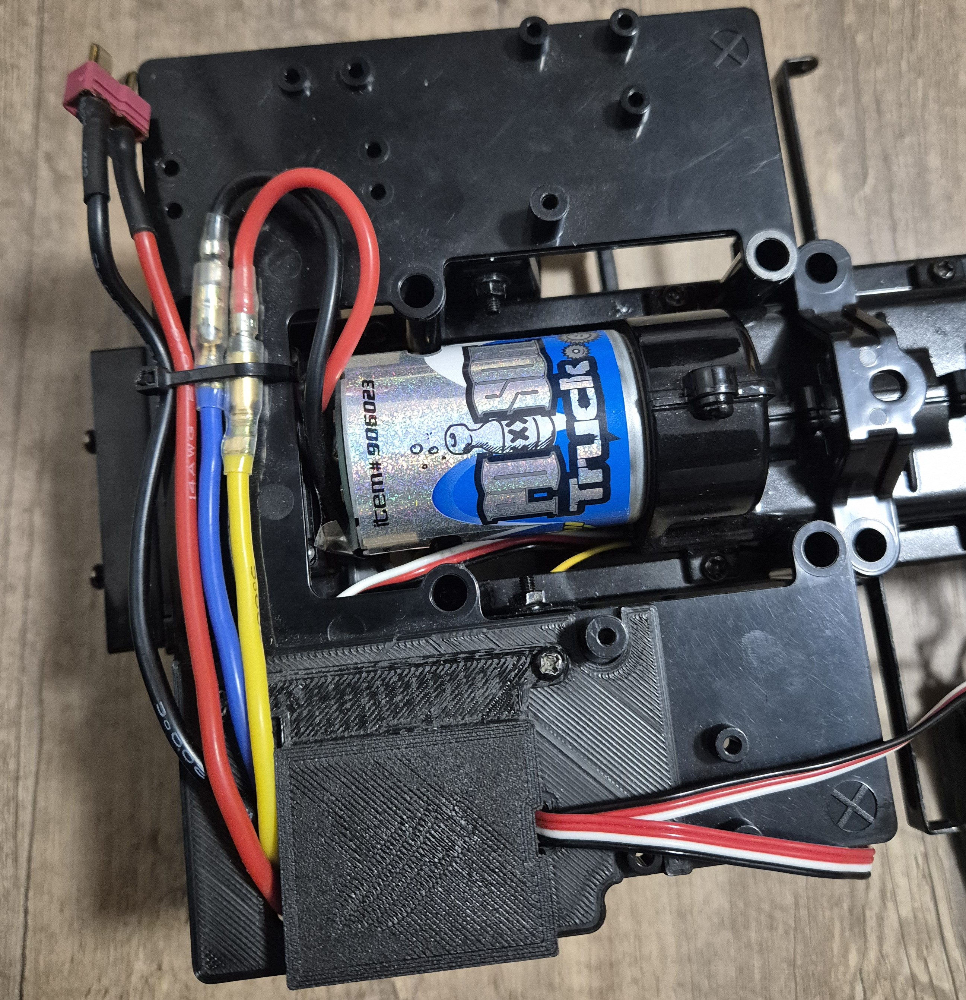
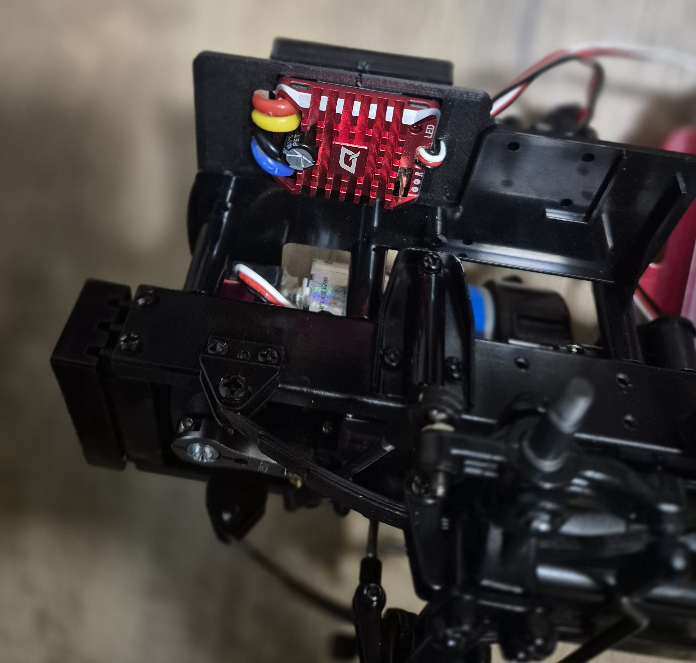
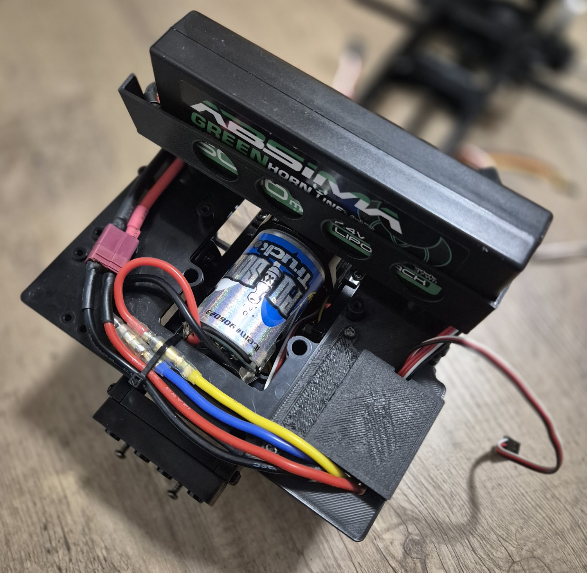
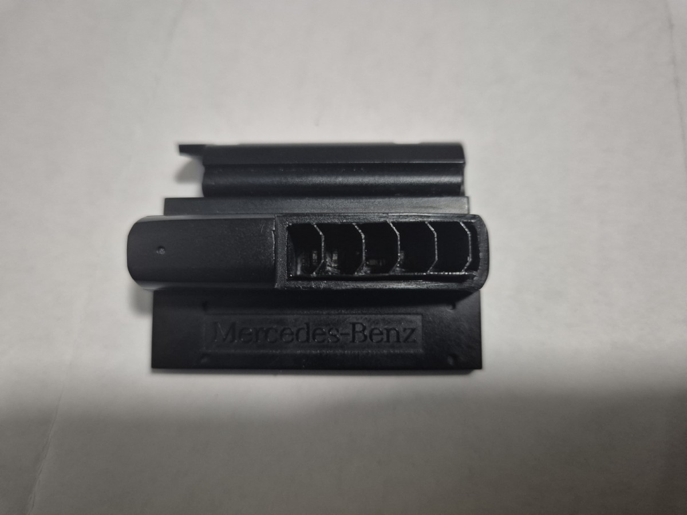
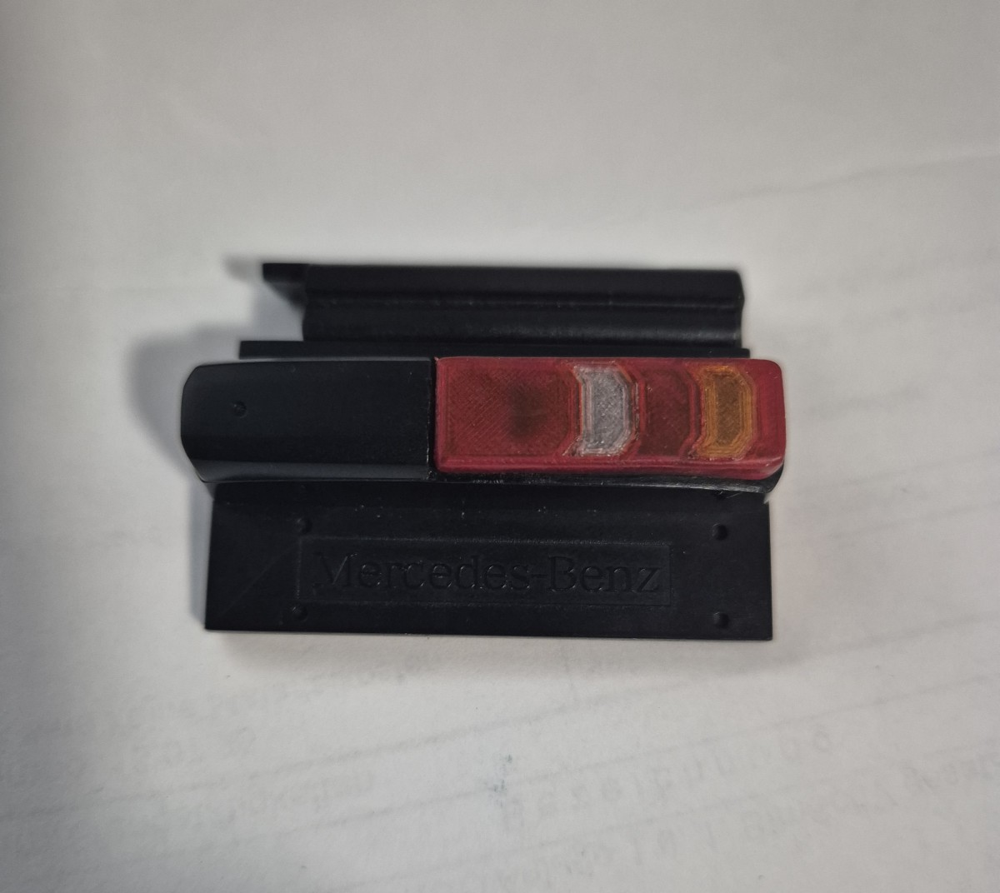

# Tamiya MB Actros extras
Some of my own "extensions" for the Tamiya Actros 1851 truck.

## esc_holder
ESC holder designed for the Hobbywing Quicrun WP 1080.

## battery_holder
Battery holder to put inside the cabin.

## rear_lights
Redesign of rear lights for 6 LEDs and custom board.

